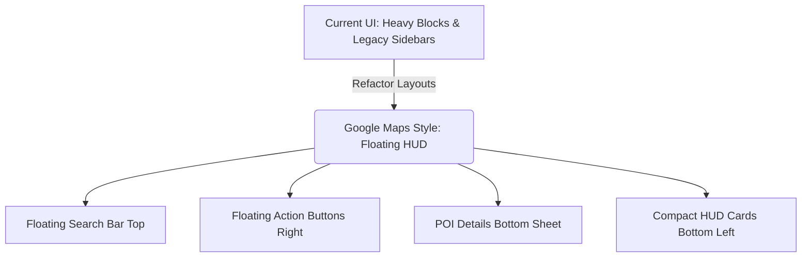

# UI Refactoring Plan: Modernizing OsmAnd to a Google Maps Aesthetic

This document provides a technical assessment and a step-by-step roadmap for refactoring OsmAnd's user interface to match a modern, clean map application aesthetic (similar to Google Maps/Material 3).

---

## 1. Feasibility Assessment

**Yes, it is entirely possible** to refactor the application's user interface. However, OsmAnd is a large, feature-rich project with years of legacy code. The UI relies on deep XML layouts, custom views, and an extensible widget/plugin system. 

To make this refactoring manageable and avoid breaking core navigation features, we recommend a **Google Maps (Material 3)** aesthetic over a Waze aesthetic.
* **Why Google Maps style?** It leverages standard Material Design 3 patterns (floating cards, rounded corners, clean bottom navigation, search anchor cards). OsmAnd is already built on Android Material Components, making this transition a natural evolution.
* **Why not Waze?** Waze uses a highly customized, colorful, cartoonish visual identity (thick borders, proprietary fonts, custom cartoonish icons, distinct animations) which would require rewriting the rendering styles and replacing thousands of assets, introducing high complexity.

---

## 2. Current UI Architecture Analysis

To refactor the visual layer, we must target these critical files and structures:

* **Main Screen Activity:** [MapActivity.java](file:///workspaces/OsmAnd/OsmAnd/src/net/osmand/plus/activities/MapActivity.java) handles the core layout orchestration, lifecycle, and view bindings.
* **Main Layout XML:** [main.xml](file:///workspaces/OsmAnd/OsmAnd/res/layout/main.xml) contains the root `DrawerLayout`, the map canvas view, and containers for hud overlays and menus.
* **HUD Overlay Layout:** [map_hud_layout.xml](file:///workspaces/OsmAnd/OsmAnd/res/layout/map_hud_layout.xml) acts as the container overlay for widgets, quick actions, and panels.
* **Top Toolbar & Bar:** [widget_top_bar.xml](file:///workspaces/OsmAnd/OsmAnd/res/layout/widget_top_bar.xml) and [map_hud_top.xml](file:///workspaces/OsmAnd/OsmAnd/res/layout/map_hud_top.xml) control top widgets and action bars.
* **Bottom Controls:** [map_hud_bottom.xml](file:///workspaces/OsmAnd/OsmAnd/res/layout/map_hud_bottom.xml) manages speedometers, progress bars, and recording buttons.

---

## 3. Design Strategy (Google Maps / Material 3 Style)

To achieve a modern look, we will focus on these key design system updates:

### A. Theming & Colors (Material 3)
* Update colors in `colors.xml` and `themes.xml` to match a modern tonal palette:
  * **Light Theme:** Soft gray backgrounds (`#F8F9FA`), pure white floating cards, and navy blue primary accents.
  * **Dark Theme:** Sleek dark gray (`#1C1B1F` or `#121212`) with subtle lighter gray card backgrounds (`#2D2D30`) and soft blue accents.
* Remove legacy heavy gradients and sharp borders.

### B. Rounded Shapes & Elevation
* Apply card-based layouts with high corner-radius properties (`16dp` to `28dp` for search bars and panels) to simulate floating elements.
* Replace standard rectangular buttons with rounded Floating Action Buttons (FABs) using Material Shape appearances.

### C. HUD Simplification
* Replace legacy side panel lists with compact, floating action buttons stacked vertically on the right.
* Unify widgets (speedometer, compass, GPS info) into a clean, floating dashboard overlay card rather than separate block elements.

---

## 4. Phase-by-Phase Implementation Plan

To execute this project safely without disrupting the build, we divide the roadmap into 5 logical phases:

### Phase 1: Material 3 Foundation & Design Tokens [COMPLETED]
* Define standard Material 3 color resources, text styles, and dimen definitions.
* Create reusable styles for **Floating Cards** and **FABs** inside `styles.xml` and `attrs.xml`. (Added squircle rounding to `sizes.xml` via `map_button_rect_rad` = `16dp` and `dlg_button_rect_rad` = `8dp`).
* Update status bar and app bar color tokens in `colors.xml` to match clean white/dark gray backgrounds and allow fully transparent overlays.

### Phase 2: Main Layout Redesign (Floating Search Bar & Bottom Nav) [COMPLETED]
* Refactor [widget_top_bar.xml](file:///workspaces/OsmAnd/OsmAnd/res/layout/widget_top_bar.xml) into a floating search card with rounded corners (`24dp`), an embedded hamburger menu icon, search text, and a profile avatar. [COMPLETED]
* Implement a persistent modern Bottom Navigation Bar/Sheet to replace the legacy navigation drawer where appropriate, simplifying menu discovery. [COMPLETED] (Added `BottomNavigationView` in [main.xml](file:///workspaces/OsmAnd/OsmAnd/res/layout/main.xml) using menu resource [main_bottom_navigation.xml](file:///workspaces/OsmAnd/OsmAnd/res/menu/main_bottom_navigation.xml)).

### Phase 3: HUD Widgets & Panel Modernization [COMPLETED]
* Redesign `VerticalWidgetPanel` and `SideWidgetsPanel` styles. (Side widget backgrounds updated to `12dp` rounded cards in `bg_side_widget_day.xml`).
* Refactor [speedometer_widget.xml](file:///workspaces/OsmAnd/OsmAnd/res/layout/speedometer_widget.xml) and other HUD elements to display as translucent, rounded cards. (Speedometer shape rounded to circular `44dp` shape).
* Clean up layout margins, padding, and alignments to match a balanced, high-end feel.
* Rounded top-left/top-right corners of sliding menus and bottom drawer context menus to `16dp` in `bg_map_context_menu_*.xml` and `bg_bottom_menu_*.xml` to behave like Material 3 bottom sheets.

### Phase 4: Map Rendering Style Adjustments [RESTRICTED]
* Note: Map styles (`.render.xml`) are hosted in external resources at `../../resources` which are out-of-scope for the sandboxed codebase workspace. Map styling updates should be done via application settings configuration or custom map layer stylesheets.

### Phase 5: Modern Jetpack Compose Migration [IN PROGRESS]
* In accordance with project guidelines, construct new UI screens or dialogs (e.g., POI details, Quick Actions) using **Jetpack Compose**.
* Wrap Compose code in Android View containers to seamlessly integrate them into legacy layout files like [main.xml](file:///workspaces/OsmAnd/OsmAnd/res/layout/main.xml).
* Created a complete set of modern Compose components for quick action previews and list management in [QuickActionComposeViews.kt](file:///workspaces/OsmAnd/OsmAnd/src/net/osmand/plus/quickaction/QuickActionComposeViews.kt).

---

## 5. Technical Constraints & Risks

1. **Gradle Build Restriction:** We must not invoke Gradle tasks directly. All layout modifications and code additions must be lint-checked locally or verified via standard IDE tools rather than running build targets.
2. **JNI / Core Engine Integration:** Avoid touching underlying map graphics logic in `OsmAndCore` (C++). Keep modifications strictly within the Android view overlays and standard layouts.
3. **Screen Adaptation:** OsmAnd runs on tablets, Android Auto, and mobile screens. Any redesign of layout files must be thoroughly tested for landscape orientation and tablet layouts (`layout-sw600dp`).
